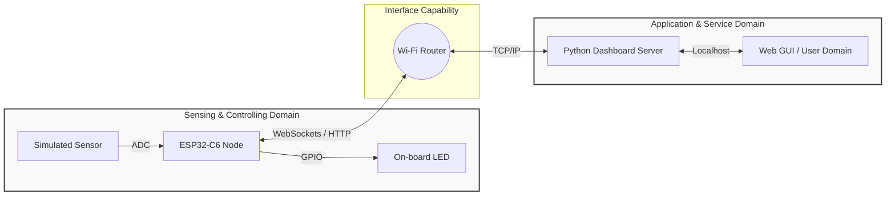
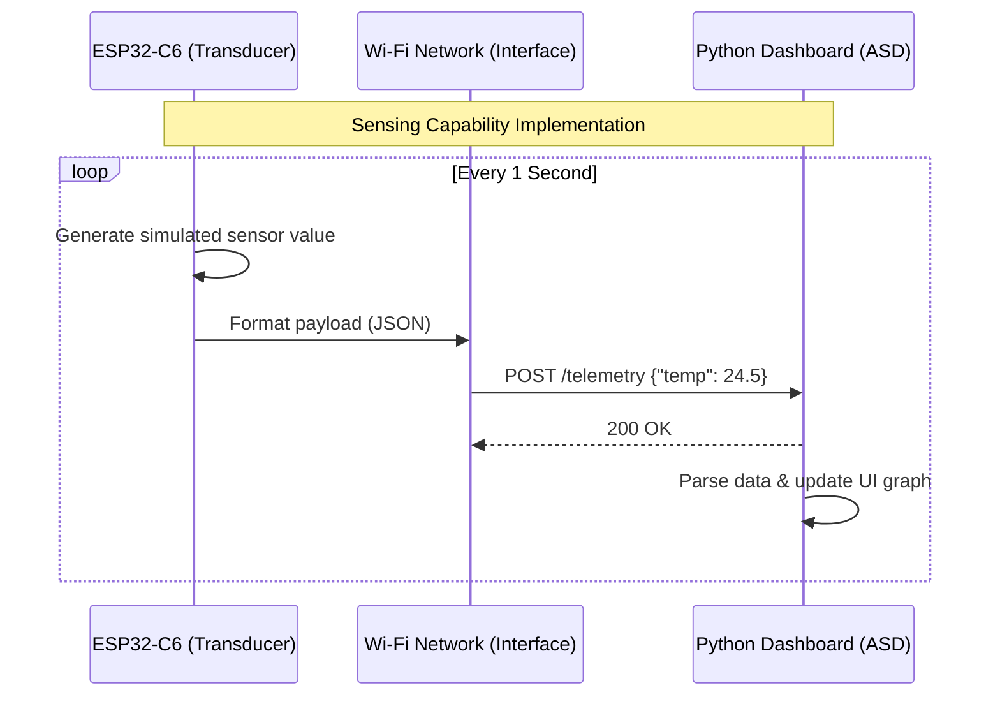
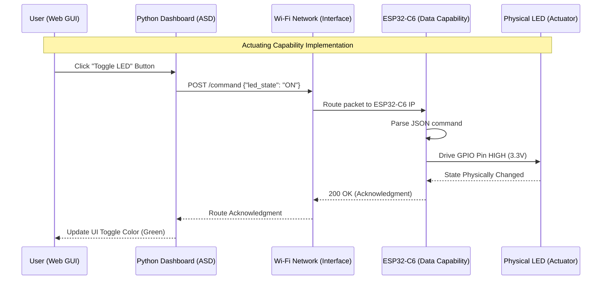

# Lecture 1: Minimal IoT Implementation and Architecture

**Course:** IoT Systems Design  
**Target Hardware:** ESP32-C6 (Wi-Fi 6, Bluetooth 5, Zigbee/Thread)  
**Target Software:** Python (`tools/dashboard_http.py`)  
**Standard Reference:** ISO/IEC 30141:2024  

---

## Introduction to Lab 0: Minimal IoT Implementation

* **Objective:** To understand the fundamental architectural principles of IoT as defined by **ISO/IEC 30141:2024** and successfully build a minimal IoT system mapping physical hardware to a digital application interface.
* **Core Technologies:** ESP32-C6 Microcontroller, Python, WebSockets/HTTP.

---

## What is an IoT System? 
*Defining the Paradigm (ISO/IEC 30141:2024)*

* **The Conceptual Shift:** An embedded device is not inherently an IoT device.
* **1. A Many-to-Many Digital Network:** The system must utilize network capabilities that support routing beyond simple point-to-point connections.
* **2. Physical World Interaction:** The system must possess at least one component that interacts with the physical world through **sensing** or **actuating**.


---

## The IoT Component Pattern
*Deconstructing the Node (§6.7.3)*

* In our lab, the **ESP32-C6** functions as a single **Component**. According to the standard, an IoT Component is defined by five categories of capabilities:
    1. **Transducer Capabilities:** Bridging the physical and digital (Sensing/Actuating).
    2. **Data Capabilities:** Processing, storing, and transferring data locally.
    3. **Interface Capabilities:** Connecting to networks, applications, and human users.
    4. **Supporting Capabilities:** Device management, security, and identity.
    5. **Latent Capabilities:** Potential functions not currently active or provisioned.


---

## Transducer Capabilities: Sensing vs. Actuating
*The Bridge Between Digital and Physical*

* **Sensing Capability:** Acquiring information from the physical world and converting it into a digital representation (Analog-to-Digital).
* **Actuating Capability:** Converting digital commands into physical actions, altering the state of the physical world (Digital-to-Analog / PWM / GPIO).
* **The IoT Core Loop:** The constant interplay between data collection and system response.


---

## Interface Capabilities
*Why a 'Network Interface' is Mandatory*

* **Network Interface Capability:** Dictates how the device connects to the **many-to-many digital network** (e.g., 802.11 Wi-Fi).
* **Application Interface Capability:** How the component exposes its data and services to software (e.g., RESTful APIs, MQTT).
* **Human User Interface Capability:** Direct human interaction (e.g., physical buttons, local displays).


---

## The Architecture of Lab 1
*Mapping the SCD to the ASD*

* **Sensing and Controlling Domain (SCD):** The ESP32-C6 gathering data and executing commands.
* **Application and Service Domain (ASD):** The Python-based dashboard providing logic and visualization.
* **The Goal:** Establish reliable, bidirectional communication.



## Exercise Step 1: Launching the Application Domain
*Running the Dashboard*

**Objective:** Initialize the Application and Service Domain (ASD).

**Action:** Execute python tools/dashboard_http.py on your workstation.

**Under the Hood:** Spins up a local server and provisions an Application Interface Capability listening for edge devices.

```bash
~/Documents/4201327-IoT_Systems_Design_Labs/tools$ python3 dashboard_http.py 
[*] Dashboard running. Target ESP32 IP: 10.71.203.63
 * Serving Flask app 'dashboard'
 * Debug mode: off
```

## Exercise Step 2: Sensing Implementation
Simulating Telemetry

**Objective:** Implement a Sensing Capability.

**Action:** Flash the ESP32-C6 to transmit continuous dummy data.



## Exercise Step 3: Actuating Implementation
*Closing the Control Loop*

**Objective:** Implement an Actuating Capability.

**Action:** Toggle the on-board LED from the dashboard UI.



## ESP32-C6 Firmware (Zephyr)

The firmware lives in [`firmware/lab0_http/`](../firmware/lab0_http/). The Zephyr
application is scaffolded for you; **four pieces are missing and you write them**:

```
firmware/lab0_http/
├── CMakeLists.txt                       # given
├── Kconfig                              # given - Wi-Fi credentials
├── prj.conf                             # TASK 1
├── sections-rom.ld                      # given - linker section for the resources
├── boards/
│   └── esp32c6_devkitc_hpcore.overlay   # given - the on-board RGB LED
└── src/main.c                           # TASKS 2, 3, 4
```

| | What you write | Capability |
|---|---|---|
| **TASK 1** | Four `CONFIG_` symbols in `prj.conf` | all four |
| **TASK 2** | `led_set()` — drive the WS2812 | Actuating |
| **TASK 3** | `sensor_handler()` — build the reading and respond | Sensing + Data |
| **TASK 4** | `control_handler()` — parse the command, actuate, reply | Actuating + Data |

Each spot is marked with a `TASK n` comment in the file, stating what is expected and
how to check it. The build system, the Wi-Fi association code and the HTTP resource
registration are done for you — they are plumbing, not architecture.

Work in order. **TASK 1 first**: until those symbols are set the build fails with
`'CONFIG_HTTP_SERVER_MAX_CLIENTS' undeclared`, because the subsystem is not compiled
in. Once TASK 1 is right, the project builds and runs — it simply does nothing yet,
which is your baseline. A `'control_cmd_descr' defined but not used` warning is
expected until TASK 4 is done.

### 0. A warning about the "on-board LED"

The C6-DevKitC-1 does **not** have a plain GPIO LED. The single controllable LED is
an **addressable WS2812** on GPIO8, which expects a precise pulse train rather than a
level. Driving it with a GPIO write does nothing visible.

So the LED is a devicetree node driven through the `led_strip` API, declared in
`boards/esp32c6_devkitc_hpcore.overlay`:

```dts
&i2s_default {
	group1 {
		pinmux = <I2S_O_SD_GPIO8>;
	};
};

i2s_led: &i2s {
	status = "okay";
	dmas = <&dma 3>;
	dma-names = "tx";

	led_strip: ws2812@0 {
		compatible = "worldsemi,ws2812-i2s";
		reg = <0>;
		chain-length = <1>;
		color-mapping = <LED_COLOR_ID_GREEN LED_COLOR_ID_RED LED_COLOR_ID_BLUE>;
		reset-delay = <500>;
	};
};
```

This is the first place the Zephyr model shows itself: the *board* description says
which pin the LED is on and how it is driven; `main.c` only asks for
`DT_ALIAS(led_strip)` and sets a colour. Port the application to a board with a plain
GPIO LED and only the overlay changes.

### 1. Wi-Fi credentials

Wi-Fi credentials are Kconfig symbols declared in the app's own `Kconfig`:

```kconfig
config LAB_WIFI_SSID
	string "Wi-Fi SSID"
	default "changeme"

config LAB_WIFI_PSK
	string "Wi-Fi password"
	default "changeme"
```

Set them for a build without editing tracked files. Run this from the application
directory — the `.` is the app, and it is `lab0_http/`, not `firmware/`:

```bash
source ~/zephyrproject/env.sh          # every new terminal needs this
cd firmware/lab0_http                  # the directory holding CMakeLists.txt

west build -p always -b esp32c6_devkitc/esp32c6/hpcore . \
  -- -DCONFIG_LAB_WIFI_SSID='"YourNetwork"' -DCONFIG_LAB_WIFI_PSK='"YourPassword"'
```

> The quoting is deliberate: Kconfig string values need their own quotes *inside* the
> shell quotes. `-DCONFIG_LAB_WIFI_SSID=YourNetwork` fails.

> `west: command not found` means the first line was skipped. Install nothing — `west`
> lives in the Zephyr venv, and `apt install west` is an unrelated package.

The ESP32-C6 radio is **2.4 GHz only**. A 5 GHz-only SSID will never associate.

### 2. Which subsystems get built

`prj.conf` selects which subsystems are built in. Every capability in the ISO model
maps to a line here:

```conf
CONFIG_WIFI=y            # Network Interface Capability
CONFIG_HTTP_SERVER=y     # Application Interface Capability
CONFIG_JSON_LIBRARY=y    # Data Capability
CONFIG_LED_STRIP=y       # Actuating Capability
CONFIG_NET_DHCPV4=y
```

### 3. Sensing capability — `GET /api/sensor`  ·  TASK 3

Zephyr's HTTP server is declarative: a resource is bound to a service at build time,
and your callback is invoked when a request arrives. The registration is already
written for you:

```c
HTTP_RESOURCE_DEFINE(sensor_resource, iot_service, "/api/sensor", &sensor_resource_detail);
```

What you write is the callback body. Two things govern it.

**The callback fires more than once per request.** It is called as the request
streams in, and again when the request is complete. Only the final call expects a
response, which is why the stub guards on:

```c
if (status != HTTP_SERVER_REQUEST_DATA_FINAL) {
	return 0;
}
```

A GET carries no body and *still* gets an earlier callback. Respond on the wrong one
and the client sees a truncated or empty reply.

**You answer by filling a struct, not by calling a send function.** The fields you
need on `response_ctx`:

| Field | Meaning |
|---|---|
| `status` | `HTTP_200_OK` |
| `headers` / `header_count` | the `Content-Type` array already declared in the stub |
| `body` / `body_len` | your JSON and its length |
| `final_chunk` | `true` — you have no more data to send |

The body must be JSON with a field named exactly `temperature`; that is what the
dashboard reads. `sys_rand32_get()` is already included for the simulated reading.
Anything in 20.0–29.9 °C is fine.

Check it before moving on:

```bash
curl http://<board-ip>/api/sensor
# {"temperature": 24.7}
```

### 4. Actuating capability — `POST /api/control`  ·  TASK 4

This one receives data, so it has two traps rather than one.

**The body can arrive in pieces.** Even a 12-byte payload may be split across
callbacks, so the handler must accumulate into a buffer and parse only at
`HTTP_SERVER_REQUEST_DATA_FINAL`. That accumulation is written for you in the stub —
read it, because forgetting this pattern produces a parser that works on your desk
and fails on a loaded network.

**`json_obj_parse()` does not return 0 on success.** It returns a *bitmask*, one bit
per field it managed to fill. To check that every expected field was present:

```c
ret == BIT_MASK(ARRAY_SIZE(control_cmd_descr))
```

Treating a non-zero return as failure — or as success — is the usual bug here. The
descriptor `control_cmd_descr` and the `struct control_cmd` are already declared; you
call the parser, check it properly, and drive `led_set()` with the result.

Then answer with the `ok_body` the stub declares, using the same `response_ctx`
fields as TASK 3, so the dashboard sees `{"status": "ok"}`.

```bash
curl -X POST http://<board-ip>/api/control \
     -H 'Content-Type: application/json' -d '{"state": 1}'
# {"status": "ok"}   and the LED turns green
```

### 5. The linker section

Each `HTTP_SERVICE_DEFINE` needs a matching iterable ROM section or the resource list
does not link:

```
/* sections-rom.ld */
ITERABLE_SECTION_ROM(http_resource_desc_iot_service, Z_LINK_ITERABLE_SUBALIGN)
```

```cmake
zephyr_linker_sources(SECTIONS sections-rom.ld)
zephyr_linker_section(NAME http_resource_desc_iot_service
  KVMA RAM_REGION GROUP RODATA_REGION)
```

The section name must be `http_resource_desc_<service name>`. Rename the service in
`HTTP_SERVICE_DEFINE` and you must rename the section too, or you get
`undefined reference to _http_resource_desc_..._list_start` at link time.

---

## System Integration & Verification

### Step 1: Build and flash

```bash
source ~/zephyrproject/env.sh
cd firmware/lab0_http

west build -p always -b esp32c6_devkitc/esp32c6/hpcore . \
  -- -DCONFIG_LAB_WIFI_SSID='"YourNetwork"' -DCONFIG_LAB_WIFI_PSK='"YourPassword"'
west flash
```

### Step 2: Read the node's IP address

Open the console **on the UART port** (`/dev/ttyUSB0`) and reset the board:

```bash
west espressif monitor -p /dev/ttyUSB0
```

```
[00:00:03.412] <inf> lab0_http: Connecting to "YourNetwork"...
[00:00:05.220] <inf> lab0_http: Associated with "YourNetwork"
[00:00:06.918] <inf> lab0_http: IPv4 address: 192.168.1.100
[00:00:06.925] <inf> lab0_http: HTTP server listening on port 80
```

Confirm the node answers before involving the dashboard:

```bash
curl http://192.168.1.100/api/sensor
# {"temperature": 24.7}

curl -X POST http://192.168.1.100/api/control \
     -H 'Content-Type: application/json' -d '{"state": 1}'
# {"status": "ok"}
```

The LED should turn green on the second command. If `curl` works and the dashboard
does not, the problem is in the dashboard's `ESP32_IP`, not the firmware.

### Step 3: Launch the Application Domain

Put the address from step 2 into `tools/dashboard_http.py`:

```python
# --- Network Configuration ---
ESP32_IP = "192.168.1.100"  # <-- Update this!
```

```bash
python3 tools/dashboard_http.py
```

Open `http://localhost:5000`.

### Step 4: Verify both capabilities

- **Sensing:** the "Live Telemetry" graph gains a point every 1.5 s and the status
  reads "Connected. Live data stream active."
- **Actuating:** "Turn ON" / "Turn OFF" changes the on-board RGB LED, and each POST
  is logged on the serial console.

### When something breaks

| Symptom | Cause |
|---|---|
| `Wi-Fi association failed` | Wrong PSK, or a 5 GHz-only SSID — the C6 is 2.4 GHz only |
| Boots, no `IPv4 address` line | Associated but no DHCP lease; check the AP's DHCP pool |
| Console silent, board flashes fine | You are on `/dev/ttyACM0`; the console is on the UART port |
| `curl` times out | Node and workstation are on different subnets, or AP client isolation is on |
| LED never lights | Overlay missing from the build — confirm `boards/` sits next to `CMakeLists.txt` |
| `undefined reference to _http_resource_desc_*` | Linker section name does not match the service name |
