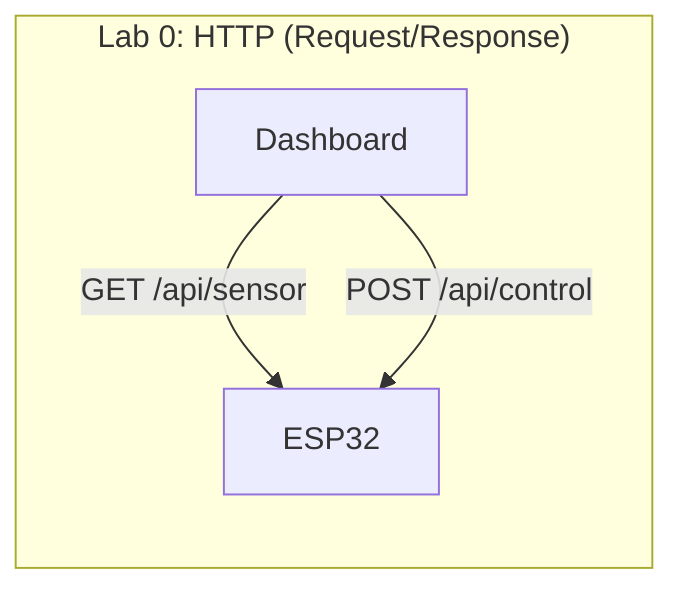
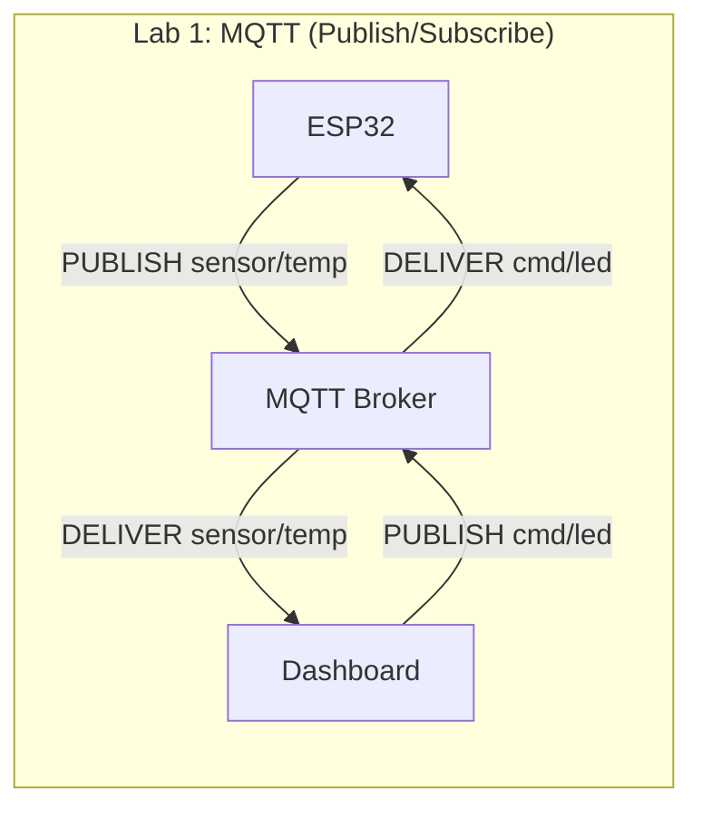
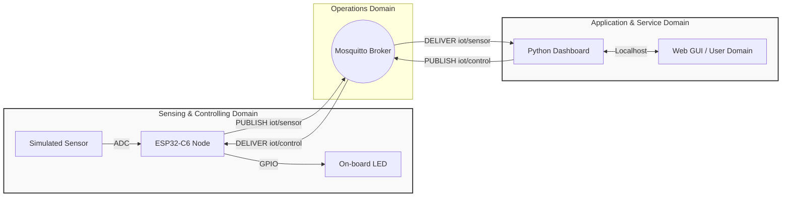
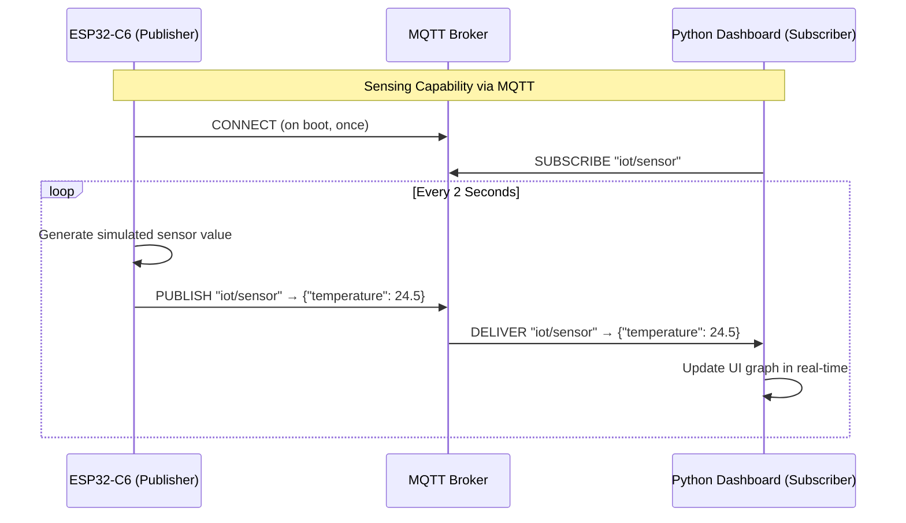
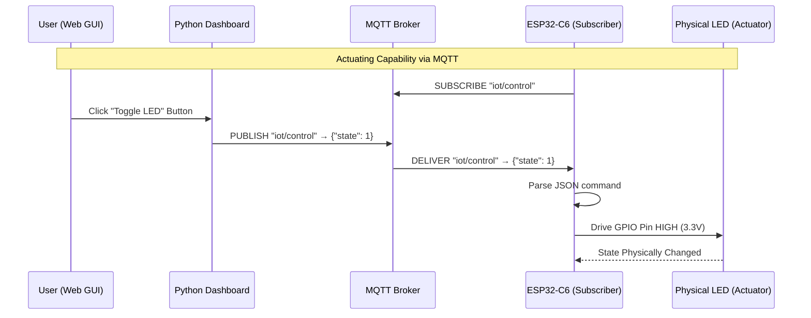

# Lecture 2: Minimal IoT Implementation — MQTT

**Course:** IoT Systems Design
**Target Hardware:** ESP32-C6 (Wi-Fi 6, Bluetooth 5, Zigbee/Thread)
**Target Software:** Python (`tools/dashboard_mqtt.py`)
**Standard Reference:** ISO/IEC 30141:2024
**Prerequisite:** Lab 0 (HTTP version) completed

---

## Introduction

* **Objective:** Rebuild the same Sensing + Actuating IoT system from Lab 0 using **MQTT** instead of HTTP, and understand how the choice of application protocol fundamentally changes the system architecture.
* **Core Technologies:** ESP32-C6, Python, MQTT (Mosquitto broker), `paho-mqtt`.

---

## HTTP vs MQTT: Why a Different Protocol?

In Lab 0 we used HTTP — a **request/response** protocol where the dashboard must actively poll the ESP32 for sensor data. This works, but it has architectural implications that become problematic at scale.

| Aspect | HTTP (Lab 0) | MQTT (Lab 1) |
|---|---|---|
| **Pattern** | Request/Response (Client/Server) | Publish/Subscribe (Broker-mediated) |
| **Transport** | TCP port 80 | TCP port 1883 |
| **Who initiates?** | Dashboard polls ESP32 | ESP32 pushes data to broker |
| **Overhead per message** | ~200-800 bytes (HTTP headers) | ~2 bytes (fixed header) |
| **ESP32 role** | Server (listens for connections) | Client (connects outward to broker) |
| **Scalability** | Dashboard must poll each node individually | Broker fans out to all subscribers |
| **Firewall/NAT friendly** | No — ESP32 must accept inbound connections | Yes — ESP32 only makes outbound connections |

### The Architectural Shift

In Lab 0, the **ESP32 was a server** — it listened on port 80 and waited for the dashboard to request data. This is conceptually simple but creates several problems:
- The dashboard must know every node's IP address
- Nodes behind NAT or firewalls cannot be reached
- Polling wastes bandwidth when there is no new data
- Adding a new dashboard/consumer requires changes to the ESP32

With MQTT, **both the ESP32 and the dashboard are clients** that connect to a central **broker**. The ESP32 *publishes* data, and the dashboard *subscribes* to it. Neither needs to know the other's IP address.





---

## MQTT Fundamentals
*The Publish/Subscribe Model*

### Topics

MQTT organizes messages by **topics** — hierarchical strings separated by `/`. There are no predefined endpoints like HTTP URIs; any client can publish or subscribe to any topic.

For our lab, we will use:
- **`iot/sensor`** — ESP32 publishes sensor telemetry here
- **`iot/control`** — Dashboard publishes LED commands here

### Quality of Service (QoS)

MQTT provides three delivery guarantees:
- **QoS 0:** At most once (fire and forget) — suitable for frequent sensor readings
- **QoS 1:** At least once (acknowledged delivery) — suitable for control commands
- **QoS 2:** Exactly once (four-step handshake) — rarely needed

### The Broker

The broker is the central relay. Every MQTT message passes through the broker. For this lab we use **Mosquitto**, an open-source MQTT broker that can run locally on your computer.

---

## The Architecture of Lab 1
*Mapping the SCD to the ASD via MQTT*

* **Sensing and Controlling Domain (SCD):** The ESP32-C6 — now a *publisher* of sensor data and a *subscriber* to control commands.
* **Application and Service Domain (ASD):** The Python dashboard — now a *subscriber* to sensor data and a *publisher* of control commands.
* **Operations Domain:** The MQTT broker (Mosquitto), routing messages between domains.



---

## Exercise Step 0: Install the MQTT Broker
*Setting Up the Operations Domain*

**Objective:** Provision the message broker that will route all MQTT traffic.

**Action:** Install and start Mosquitto on your workstation.

### Windows

1. Download the Mosquitto installer from [mosquitto.org/download](https://mosquitto.org/download/) (choose the **Win64** `.exe` installer).
2. Run the installer. When prompted, check the option to **install as a service**.
3. After installation, Mosquitto's default directory is `C:\Program Files\mosquitto\`.

**Configure for local network access:** By default, Mosquitto 2.x only accepts connections from `localhost`. We need to allow connections from the ESP32 on the Wi-Fi network.

Open `C:\Program Files\mosquitto\mosquitto.conf` in a text editor (run as Administrator) and add these two lines at the end:

```
listener 1883
allow_anonymous true
```

**Start/Restart the service:**
```cmd
:: Open a Command Prompt as Administrator
net stop mosquitto
net start mosquitto
```

> **Alternative:** You can also start/stop the service from the Windows Services panel (`services.msc`), look for "Mosquitto Broker".

**Quick Test:** Open **two** Command Prompt windows:
```cmd
:: Terminal 1: Subscribe
"C:\Program Files\mosquitto\mosquitto_sub" -h localhost -t "test/hello"

:: Terminal 2: Publish
"C:\Program Files\mosquitto\mosquitto_pub" -h localhost -t "test/hello" -m "Hello from MQTT!"
```

You should see the message appear in Terminal 1. This confirms the broker is working.

> **Firewall:** If the ESP32 cannot connect to the broker, ensure Windows Firewall allows inbound connections on **TCP port 1883**. You can add a rule via: *Windows Defender Firewall → Advanced Settings → Inbound Rules → New Rule → Port → TCP 1883 → Allow*.

### Linux (Ubuntu/Debian)

```bash
# Ubuntu/Debian
sudo apt install mosquitto mosquitto-clients

# Verify it is running
systemctl status mosquitto
```

Mosquitto will listen on `localhost:1883` by default. For this lab, we need it to accept anonymous connections on the local network. Create or edit `/etc/mosquitto/conf.d/lab.conf`:

```
listener 1883
allow_anonymous true
```

Then restart the service:
```bash
sudo systemctl restart mosquitto
```

**Quick Test:** Open two terminals and verify the broker works:
```bash
# Terminal 1: Subscribe
mosquitto_sub -h localhost -t "test/hello"

# Terminal 2: Publish
mosquitto_pub -h localhost -t "test/hello" -m "Hello from MQTT!"
```

You should see the message appear in Terminal 1. This confirms the broker is working.

---

## Exercise Step 1: Launching the Application Domain
*Running the MQTT Dashboard*

**Objective:** Initialize the Application and Service Domain (ASD).

**Action:** Install the Python dependency and run the dashboard.

```bash
pip install paho-mqtt flask
python tools/dashboard_mqtt.py
```

```bash
~/Documents/4201327-IoT_Systems_Design_Labs/tools$ python3 dashboard_mqtt.py
[*] MQTT Dashboard running.
[*] Broker: localhost:1883
[*] Subscribed to: iot/sensor
[*] Publishing control to: iot/control
 * Serving Flask app 'dashboard_mqtt'
 * Debug mode: off
```

> **Note:** Unlike the HTTP dashboard, this dashboard does **not** need the ESP32's IP address. It only needs the broker's address. The ESP32 and dashboard discover each other through shared topic names.

---

## Exercise Step 2: Sensing Implementation
*Push-Based Telemetry*

**Objective:** Implement a Sensing Capability using MQTT PUBLISH.

**Action:** Flash the ESP32-C6 to periodically publish sensor data to the broker.

**Key difference from HTTP:** The ESP32 no longer waits for the dashboard to request data. Instead, it **pushes** new readings at its own cadence.



Compare this to Lab 0 where the dashboard had to send an HTTP GET every 1.5 seconds. Here, the data flows in the opposite direction — from sensor to consumer, which is the natural direction for telemetry.

---

## Exercise Step 3: Actuating Implementation
*Command Delivery via Subscribe*

**Objective:** Implement an Actuating Capability using MQTT PUBLISH/SUBSCRIBE.

**Action:** Toggle the on-board LED from the dashboard UI.



> **Notice:** There is no HTTP response or acknowledgment from the ESP32. In MQTT, the publisher (dashboard) does not know if the subscriber (ESP32) received the message unless it explicitly publishes a confirmation back on another topic. This is a fundamental difference from the HTTP request/response model. For QoS 1+, the *broker* acknowledges receipt, but that only confirms the broker got it — not the end device.

---

## ESP32-C6 Firmware: From HTTP Server to MQTT Client

### Overview of Changes

The firmware changes from the HTTP lab to this one reflect the architectural shift:

| Component | HTTP | MQTT |
|---|---|---|
| **Project** | `firmware/lab0_http/` | `firmware/lab0_mqtt/` |
| **Zephyr subsystem** | `CONFIG_HTTP_SERVER` | `CONFIG_MQTT_LIB` |
| **Main include** | `zephyr/net/http/service.h` | `zephyr/net/mqtt.h` |
| **Server/Client** | `http_server_start()` — serves | `mqtt_connect()` — connects outward |
| **Sensing** | Handler waits for a GET | Loop publishes on a timer |
| **Actuating** | Handler waits for a POST | `MQTT_EVT_PUBLISH` callback fires |
| **Needs a poll loop** | No — the subsystem owns a thread | **Yes** — you drive the client |

That last row is the biggest practical difference. Zephyr's HTTP server runs itself
once started; its MQTT client does not. Your code owns the socket loop.

### 0. Project layout

```
firmware/lab0_mqtt/
├── CMakeLists.txt                       # given
├── Kconfig                              # TASK 2 - broker address
├── prj.conf                             # TASK 1
├── boards/
│   └── esp32c6_devkitc_hpcore.overlay   # given - the on-board RGB LED
└── src/main.c                           # TASKS 3, 4, 5
```

| | What you write | Capability |
|---|---|---|
| **TASK 1** | Four `CONFIG_` symbols in `prj.conf` | all four |
| **TASK 2** | `LAB_BROKER_ADDR` / `LAB_BROKER_PORT` in `Kconfig` | Network Interface |
| **TASK 3** | `led_set()` — drive the WS2812 | Actuating |
| **TASK 4** | `handle_control_payload()` — read, parse, actuate, **PUBACK** | Actuating + Data |
| **TASK 5** | `publish_sensor()` — fill the publish parameters | Sensing + Data |

Each spot is marked with a `TASK n` comment in the file. The Wi-Fi association code
and the MQTT poll loop are given — the loop is subtle and it is not what this lab is
teaching.

Three of these you have already solved once in the HTTP lab. **The interesting ones
are TASK 4 and TASK 5**, because they are where the publish/subscribe model differs
from request/response: nobody asks you for a reading, and nobody automatically
confirms a command was received.

Work in order — TASK 1 and TASK 2 both cause build failures until they are done, and
`main.c` already refers to `CONFIG_LAB_BROKER_ADDR`.

The LED overlay is identical to the HTTP lab — and carries the same warning: the
C6-DevKitC-1's on-board LED is an **addressable WS2812 on GPIO8**, not a plain GPIO,
so it is driven through the `led_strip` API. A GPIO write does nothing visible.

### 1. Point the node at your broker

The broker address is a Kconfig symbol, because the node must reach *your workstation*
over the Wi-Fi network:

```bash
source ~/zephyrproject/env.sh          # every new terminal needs this
cd firmware/lab0_mqtt                  # the directory holding CMakeLists.txt

west build -p always -b esp32c6_devkitc/esp32c6/hpcore . \
  -- -DCONFIG_LAB_WIFI_SSID='"YourNetwork"' \
     -DCONFIG_LAB_WIFI_PSK='"YourPassword"' \
     -DCONFIG_LAB_BROKER_ADDR='"192.168.1.50"'
```

> `west: command not found` means the first line was skipped. Install nothing — `west`
> lives in the Zephyr venv, and `apt install west` is an unrelated package.

> `192.168.1.50` must be your **PC's** address on the Wi-Fi network — the same one
> Mosquitto is bound to. `localhost` would mean the ESP32 itself. Find it with
> `ip addr` (Linux/macOS) or `ipconfig` (Windows).

### 2. Sensing capability — publishing telemetry  ·  TASK 5

Nobody asks the node for a reading. It publishes on its own schedule, which means
there is no request to respond to — only a message to describe. You describe it by
filling a `struct mqtt_publish_param`:

| Field | Holds |
|---|---|
| `message.topic.topic.utf8` / `.size` | the topic string and its length |
| `message.topic.qos` | the delivery guarantee — your choice, see below |
| `message.payload.data` / `.len` | the JSON bytes and their length |
| `message_id` | any unique id; `sys_rand16_get()` is fine |

then hand it to `mqtt_publish()`. The JSON itself is built for you in the stub, and
uses the same `temperature` field as the HTTP lab.

**Choose the QoS deliberately, and defend it in your DDR.** A telemetry sample is
replaced two seconds later, so losing one costs nothing and acknowledging every one
costs bandwidth and airtime on a battery-powered node. A control command gets no
second chance. The two paths in this lab should not use the same QoS, and the
reasoning — not the value — is what you are being assessed on.

### 3. Actuating capability — receiving commands  ·  TASK 4

Subscription happens once, from inside the `CONNACK` handler — you cannot subscribe
before the broker has accepted the connection. That part is written for you:

```c
case MQTT_EVT_CONNACK:
	connected = true;
	subscribe_control(c);
	break;

case MQTT_EVT_PUBLISH:
	handle_control_payload(c, &evt->param.publish);
	break;
```

What you write is `handle_control_payload()`, and it has two traps that have nothing
to do with HTTP:

**The payload is not in the event.** `MQTT_EVT_PUBLISH` hands you the topic and a
length, but the bytes are still sitting in the socket. You must pull them out
yourself with `mqtt_read_publish_payload_blocking()` before there is anything to
parse. Reading `evt->param.publish.message.payload` directly gets you a length and no
data.

**QoS 1 must be acknowledged.** The dashboard publishes commands at QoS 1, so the
broker holds the message until the node confirms receipt. That confirmation is a
PUBACK, sent with `mqtt_publish_qos1_ack()` and the message id from the incoming
publish.

Skip the PUBACK and the symptom is instructive rather than obvious: the command works
*once*, and then the broker redelivers the same message indefinitely, because from
its point of view the node never received it. If your LED starts toggling on its own,
this is why.

Parsing is the same `json_obj_parse()` bitmask check you already did in the HTTP lab.

### 4. The loop you now own

```c
while (1) {
	int timeout = mqtt_keepalive_time_left(&client);

	rc = zsock_poll(fds, 1, MIN(timeout, 1000));

	if (rc > 0 && (fds[0].revents & ZSOCK_POLLIN)) {
		mqtt_input(&client);        /* process incoming packets  */
	}

	mqtt_live(&client);                 /* send PINGREQ when due     */

	if (connected && k_uptime_get() >= next_publish) {
		publish_sensor(&client);
		next_publish = k_uptime_get() + 2000;
	}
}
```

Three jobs share one loop: `mqtt_input()` handles arriving packets, `mqtt_live()`
sends the keepalive ping, and the timer check publishes telemetry. Drop `mqtt_live()`
and the broker disconnects you after the keepalive interval with no obvious error —
the node simply stops appearing.

The outer loop reconnects: if the broker restarts or Wi-Fi drops, the inner loop
breaks, and after five seconds the node dials again.

---

## System Integration & Verification

### Step 1: Confirm the broker accepts network connections

Before flashing anything, prove Mosquitto is reachable **from the network**, not just
from localhost. One command settles it:

```bash
ss -lnt | grep 1883
```

```
LISTEN 0 100 0.0.0.0:1883 0.0.0.0:*      # reachable from the board
LISTEN 0 100 127.0.0.1:1883 0.0.0.0:*    # localhost only - the board cannot connect
```

If you see `127.0.0.1`, the `listener 1883` line from Step 0 is not in effect. The
usual cause is ordering: installing the package starts the service immediately, so a
restart that happens *before* `lab.conf` is written leaves the old localhost-only
config running. Restart again and re-check:

```bash
sudo systemctl restart mosquitto
```

This distinction matters because a localhost-only broker passes the Step 0 test
perfectly — `mosquitto_sub -h localhost` works fine — while refusing every connection
from the board. Then confirm from the address the board will actually use:

```bash
mosquitto_sub -h 192.168.1.50 -t "iot/#" -v
```

### Step 2: Build and flash

```bash
source ~/zephyrproject/env.sh
cd firmware/lab0_mqtt

west build -p always -b esp32c6_devkitc/esp32c6/hpcore . \
  -- -DCONFIG_LAB_WIFI_SSID='"YourNetwork"' \
     -DCONFIG_LAB_WIFI_PSK='"YourPassword"' \
     -DCONFIG_LAB_BROKER_ADDR='"192.168.1.50"'
west flash
west espressif monitor -p /dev/ttyUSB0
```

```
[00:00:03.412] <inf> lab0_mqtt: Connecting to "YourNetwork"...
[00:00:05.220] <inf> lab0_mqtt: Associated with "YourNetwork"
[00:00:06.918] <inf> lab0_mqtt: IPv4 address: 192.168.1.100
[00:00:06.930] <inf> lab0_mqtt: Connecting to broker 192.168.1.50:1883
[00:00:07.104] <inf> lab0_mqtt: Connected to broker
[00:00:07.210] <inf> lab0_mqtt: Subscribed to iot/control
[00:00:09.212] <inf> lab0_mqtt: Publishing to iot/sensor: {"temperature": 24.7}
```

The `mosquitto_sub` window from Step 1 should now be printing those same readings.
**Verify this before starting the dashboard** — it separates a firmware problem from a
dashboard problem.

Drive the LED by hand from the other direction:

```bash
mosquitto_pub -h 192.168.1.50 -t "iot/control" -q 1 -m '{"state": 1}'
```

### Step 3: Launch the Application Domain

```bash
python3 tools/dashboard_mqtt.py
```

Note what you did **not** have to do: there is no `ESP32_IP` to edit. The dashboard
only needs the broker. Adding a second node changes nothing on the dashboard side —
that is the coupling difference the Discussion section asks about.

Open `http://localhost:5000`.

### Step 4: Verify both capabilities

* **Sensing:** the telemetry graph updates as the node publishes. The dashboard is
  **not polling** — data arrives when it is produced.
* **Actuating:** "Turn ON" / "Turn OFF" publishes to `iot/control`, the broker
  delivers it, and the RGB LED changes.

### When something breaks

| Symptom | Cause |
|---|---|
| `Wi-Fi association failed` | Wrong PSK, or a 5 GHz-only SSID — the C6 is 2.4 GHz only |
| `mqtt_connect failed (-111)` | Connection refused: broker not listening on the LAN, or firewall blocks 1883 |
| `mqtt_connect failed (-113)` | No route to host — wrong `LAB_BROKER_ADDR`, or different subnets |
| Connects, then drops every ~60 s | `mqtt_live()` not being called often enough in the loop |
| Same command delivered repeatedly | Missing QoS 1 PUBACK |
| Publishes fine, dashboard shows nothing | Topic mismatch — the dashboard subscribes to `iot/sensor` exactly |
| Console silent, board flashes fine | You are on `/dev/ttyACM0`; the console is on the UART port |

---

## Discussion: HTTP vs MQTT Trade-offs

After completing both labs, consider these questions:

1. **Direction of data flow:** In HTTP, who initiates the sensor data transfer? In MQTT? Which matches the natural flow of telemetry data?

2. **Coupling:** In HTTP, the dashboard needs the ESP32's IP address. In MQTT, what does each party need to know? What happens if you add a second ESP32 node?

3. **Scalability:** If you had 100 sensor nodes, how would the HTTP dashboard cope vs. the MQTT dashboard?

4. **Reliability:** What happens in each protocol if the dashboard goes offline for 30 seconds and comes back? Does it miss data? Can MQTT's QoS and retained messages help?

5. **Overhead:** Use Wireshark to capture traffic from both labs. Compare the packet sizes for a single sensor reading delivery.

6. **Security:** Neither lab uses encryption. What would be needed for each? (HTTPS/TLS vs MQTTS/TLS)
