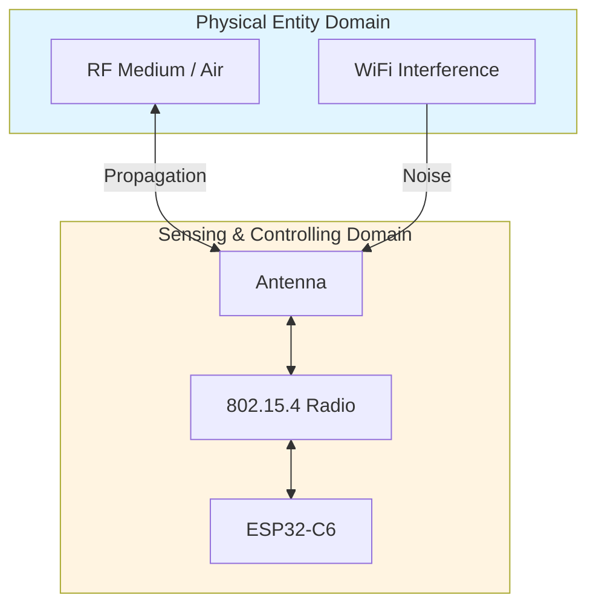

# Lab 1: Testing Your Wireless Radio

**GreenField Technologies — SoilSense Project** · Phase: Feasibility Study · 2–3 hours

**From:** Eng. Samuel Cifuentes (Senior Architect)
**Subject:** ESP32-C6 Radio Validation

> Team — the hardware group selected the ESP32-C6 for our sensor nodes based on cost
> and Thread support. Before we commit to production, I need **empirical validation**
> of the 802.15.4 radio in field conditions — data, not vendor specs:
>
> 1. What is the maximum reliable range between sensor nodes?
> 2. Which channel gives us the cleanest 2.4 GHz spectrum?
> 3. What RSSI threshold predicts 99% packet delivery?
>
> Document your findings in a DDR with ISO/IEC 30141 domain mapping (PED + SCD).

Unfamiliar terms (RSSI, PER, link budget, dBm…) are in the [glossary](../glossary.md).
Done early? [SOP-01: MAC Layer Experiments](sops/sop01_advanced_mac.md) uses the same
firmware to watch retransmissions and channel contention happen.

---

## Background: why 802.15.4 and not WiFi?

GreenField's sensors must run 3 months on 2× AA batteries. That constraint picks the radio:

| Technology | TX current | Range | Battery life* | Verdict |
|----------|----------|----------|-------|----------|
| WiFi | ~200 mA | 100 m | ~1 week | ❌ kills batteries |
| Bluetooth | ~50 mA | 10 m | ~1 month | ❌ too short range |
| **802.15.4** | ~20 mA | 100 m+ | **3+ months** | ✅ |

*periodic readings, not continuous TX.

> **In other stacks:** for 10 km pastures we'd test LoRa (sub-GHz) instead. The
> methodology (RSSI, PER, link budget) is identical — only frequencies change.

<details>
<summary><b>🔬 Advanced (optional): energy budget math & O-QPSK modulation</b></summary>

- Energy budget: 3000 mAh × 3 V = 32,400 J over 3 months (7.78×10⁶ s) → **4.2 mW average**.
  WiFi at 1% duty cycle already blows this budget.
- 802.15.4 uses **O-QPSK**: constant-envelope modulation → non-linear amplifier
  (70–80 % efficient vs 30–40 % for linear) → ~2× battery life.
- **DSSS** maps every 4-bit symbol to a 32-chip sequence (8 chips per bit, 2 Mchip/s for
  250 kbps), giving ~9 dB processing gain against interference.

</details>

## Part 1 — Setup

**Per team:** 2× ESP32-C6-DevKitC-1, 2× USB-C cables, 50 m measuring tape. Zephyr (from Week 0).

**Task 1.1** — flash [`firmware/lab1_radio`](../../firmware/lab1_radio) to both boards. It
is Zephyr's OpenThread shell with ping enabled and auto-start disabled, so your board stays
off the air until you start it:

```bash
source ~/zephyrproject/env.sh
cd firmware/lab1_radio

west build -p always -b esp32c6_devkitc/esp32c6/hpcore .
west flash
west espressif monitor -p /dev/ttyUSB0
```

Press Enter to get the `uart:~$` prompt. Every OpenThread command is `ot <command>`;
`ot help` lists them.

> **Port gotcha:** plug into the port labelled **UART** (`/dev/ttyUSB0`). The **USB** port
> flashes fine but shows no console with this board config. Exit the monitor with `Ctrl-]`.
>
> **Borrowed board?** The Thread dataset survives reflashing. Run `ot factoryreset` once
> to drop the previous team's network.

**Task 1.2** — record the hardware in your DDR (Section 4, Architectural Mapping):

| Component | ISO Domain | Justification |
|-----------|------------|---------------|
| ESP32-C6 SoC | SCD | Sensing/controlling device (§6.4–6.5) |
| 802.15.4 radio + antenna | SCD | Communication subsystem |
| Air (RF medium) | PED | Physical entity — EM propagation |

## Part 2 — Find the quietest channel

WiFi routers, microwaves and Bluetooth share the 2.4 GHz band; you want the channel
they pollute least.

**Task 2.1** — bring the radio up (receive only, nothing is transmitted yet) and
energy-scan all 16 channels (11–26), 500 ms each:

```bash
uart:~$ ot ifconfig up
uart:~$ ot scan energy 500
```

```
| Ch | RSSI |
+----+------+
| 11 | -78  |  ← WiFi interference
| 15 | -89  |  ← quietest ✅
...
```

Lower (more negative) RSSI = quieter. Real idle noise floors run −90 to −100 dBm;
higher readings mean a nearby transmitter.

**Task 2.2** — know your neighbors. 802.15.4 channel *k* is centred at
2405 + 5·(*k* − 11) MHz and is 2 MHz wide; a WiFi channel is ~20 MHz wide. Overlap:
WiFi 1 → ch. 11–14 · WiFi 6 → ch. 16–19 · WiFi 11 → ch. 21–24. Channels 15, 20, 25
and 26 fall in the gaps.

**DDR (ADR-001, Channel Selection):** which channel, its noise floor, and the PED-domain
reasoning. Include a one-liner for Edwin (field tech), e.g.:

> "Channel 15: lowest noise floor (−89 dBm), in the gap between WiFi 1 and 6 used by
> farmhouse routers. If packet loss appears in the field, first check for a new WiFi
> network on channel 1 or 6."

## Part 3 — Range testing

**Link budget in one line:** `RSSI = TX power + antenna gains − path loss`. Signal
weakens with distance; at some range too many packets are lost. You'll find that range.

<details>
<summary><b>📐 Advanced (optional): Friis equation</b></summary>

`RSSI = Ptx + Gtx + Grx − PL`, with Ptx = your `ot txpower` setting (the C6 goes up to
+20 dBm), antenna gains ≈ 2 dBi.
Free-space path loss `PL = 20·log₁₀(d) + 20·log₁₀(f) + 32.45` ≈ 60 dB at 10 m / 2.45 GHz.
Doubling the distance costs 6 dB.

</details>

### Task 3.1 — form a two-device network

One partner owns **Device A** (leader), the other **Device B** (child); each laptop runs
its own monitor.

**TX power is part of the experiment.** Set it on both boards before starting, and use the
value your instructor gives (0 dBm keeps a classroom range test inside the building):

```bash
uart:~$ ot txpower 0
```

Device A:

```bash
uart:~$ ot dataset init new
uart:~$ ot dataset channel 15            # your channel from Part 2
uart:~$ ot dataset commit active
uart:~$ ot ifconfig up
uart:~$ ot thread start
uart:~$ ot state                         # wait for: leader
```

Copy A's **entire dataset** to B as a hex blob (channel, PAN ID **and network key** must
match — the key is random, so setting channel/PAN ID by hand fails authentication):

```bash
# On A:
uart:~$ ot dataset active -x
0e08000000000001...0300000f              # paste this string to your partner

# On B:
uart:~$ ot dataset set active 0e08000000000001...0300000f
uart:~$ ot ifconfig up
uart:~$ ot thread start
uart:~$ ot state                         # child, then router within ~2 min
```

B joins as a `child` and promotes itself to `router` after a random delay of up to two
minutes. Wait for `router` before measuring — Task 3.3 reads RSSI from the neighbor
table, which lists routers on both sides.

### Task 3.2 — verify with ping

Each partner runs `ot ipaddr` and shares the **RLOC address** (the one containing
`:0:ff:fe00:` — stable and routable). Ping in both directions; expect 0 % loss at close range:

```bash
uart:~$ ot ping <partner-RLOC>
16 bytes from fd43:...: icmp_seq=1 hlim=64 time=19ms
```

### Task 3.3 — measure RSSI and PER vs distance

Full syntax: `ot ping <address> [size] [count] [interval]`. Use 100 pings × 64 bytes:

```bash
uart:~$ ot ping <partner-RLOC> 64 100 0.2
...
100 packets transmitted, 98 packets received. Packet loss = 2.0%.   ← your PER
```

Then read the signal your board received from the partner:

```bash
uart:~$ ot neighbor table
| Role | RLOC16 | Age | Avg RSSI | Last RSSI | LQ In |R|D|N| Extended MAC     | Version |
+------+--------+-----+----------+-----------+-------+-+-+-+------------------+---------+
|   R  | 0x2800 |   3 |      -66 |       -67 |     3 |1|1|1| 2a4f9c1d0e7b6a58 |       2 |
```

Procedure at each distance — **1, 5, 10, 20, 30 m…**:

1. A pings B, records packet loss; **then** B pings A (never simultaneously — concurrent
   pings on one channel collide and inflate PER).
2. Both run `ot neighbor table` and note **Avg RSSI**. RSSI is measured by the
   *receiver*, so A's table shows the B→A signal and vice versa.
3. Keep payload size and TX power fixed so PER values are comparable.

| Distance (m) | RSSI A→B | RSSI B→A | PER A→B | PER B→A |
|---|---|---|---|---|
| 1 | −45 | −47 | 0 % | 0 % |
| 10 | −65 | −67 | 1 % | 1 % |
| 30 | −78 | −82 | 10 % | 12 % |

Small A/B asymmetry is normal; >10 dB suggests a blocked antenna or one-sided interference.

**You're looking for:** the RSSI threshold where PER stays < 1 %, and the distance where
you cross it — that's your **maximum reliable range**. Summarize for both stakeholders:

> **Samuel:** "Reliability threshold −70 dBm (1 % PER); with 10 dB vegetation margin,
> recommend 15 m max spacing."
> **Gustavo:** "10-hectare field → ~49 nodes (7×7 grid at 15 m). At $40/node: $1,960."

## Part 4 — The "why" questions (DDR Section 5)

Answer in your own words — Samuel grades reasoning, not data collection:

1. **Why does RSSI drop with distance?** (Think: how a light bulb dims as you walk away.
   Key terms: power density, inverse square law, path loss.)
2. **The receiver detects signals down to −100 dBm — why did you need > −70 dBm for
   < 1 % loss?** Where do those ~30 dB go? (Key terms: fading, noise floor, fade margin, SNR.)
3. *(Optional)* **How does the radio survive WiFi interference on the same band?**
   (Key terms: DSSS spread spectrum, processing gain.)

## ISO/IEC 30141 mapping

You tested the **PED** (radio waves, interference) through the **SCD** (radio, antenna, MCU):



The standard calls this link **Proximity Networking** — the foundational data path inside
the SCD. Details on all six domains: [2_iso_architecture.md](../2_iso_architecture.md).

**Component capabilities (DDR Section 4):** ISO/IEC 30141 §9 (Tables 9–10) classifies what
a component *can* do — *transducer, data, interface, supporting, latent*. Decompose your
devkit; for each row, one sentence on why it's **active** or **latent** today:

| Category | Capability on your board | Active / Latent? |
|----------|--------------------------|-------------------|
| Transducer | On-board LED (actuating) | Active |
| Data | RSSI filtering / NVS storage / 802.15.4 TX-RX | Active |
| Interface | 802.15.4 network · OpenThread CLI · serial monitor | Active |
| Supporting | Time sync · HW crypto accelerator | Latent |
| Latent | BLE radio · WiFi radio · USB (debug only) | Latent |

This table grows as later labs enable more features.

## Deliverables

1. **DDR update** ([template](../3_deliverables_template.md)) — Section 1: device
   description; Section 2: stakeholder summaries; Section 3: ADR-001 channel selection;
   Section 4: domain mapping + capabilities table; Section 5: the three "why" answers;
   Section 10: your distance/RSSI/PER table. The DDR is iterative — get something down,
   improve it weekly. If you did SOP-01, add an "Advanced Experiments" section.

2. **One-page performance summary** for Gustavo (numbers and a recommendation, no prose):

   > - Max reliable range: ___ m (PER < 1 % when RSSI > ___ dBm)
   > - Recommended spacing: ___ m (with vegetation/obstacle margin)
   > - Best channel: ___ (noise floor ___ dBm); avoid channels ___ (WiFi)
   > - 10-hectare field: ~___ nodes × $40 = $___
   > - Verdict: ✅ proceed / ⚠️ more testing / ❌ switch platforms — and why

3. **Field checklist for Edwin** — a short troubleshooting card: *won't join* (channel
   mismatch, antenna, metal obstructions) · *intermittent loss* (RSSI < −70 dBm, WiFi
   scan, dense vegetation) · your measured range guidelines (line-of-sight / light /
   dense vegetation).

## Grading (100 pts)

| | pts |
|---|---|
| **Technical execution** — channel scan (10) · range data with RSSI+PER (15) · link budget (10) · baseline table (5) | 40 |
| **ISO/IEC 30141** — domain mapping (10) · foundational viewpoint (10) · capabilities table (5) · ADR-001 format (5) | 30 |
| **First principles** — Q1 path loss (7) · Q2 SNR/fading (7) · Q3 DSSS (6) | 20 |
| **Communication** — Samuel + Edwin summaries (5) · Gustavo report (3) · field checklist (2) | 10 |
| **Ethics (pass/fail)** — passive scanning only (no jamming); radios off when not testing | ✓ |

## Extensions (optional)

- **Outdoor range test** — compare measured path loss to the Friis prediction.
- **Interference** — create WiFi interference deliberately, measure PER impact, test channel hopping.
- **Power vs range** — `ot txpower` at +20 / +8 / 0 dBm; measure range + current; write an ADR for TX power.

## Resources & next week

[Zephyr OpenThread shell sample](https://docs.zephyrproject.org/latest/samples/net/openthread/shell/README.html) ·
[OpenThread CLI reference](https://openthread.io/reference/cli/commands) ·
[references.md](../references.md) (CLI cheat sheet, target metrics) ·
[project scenario](../1_project_scenario.md) (stakeholders)

**Lab 2:** 6LoWPAN and IPv6 addressing. Samuel's next question: *"How do we fit IPv6
into 127-byte 802.15.4 frames?"* Prep: skim RFC 6282.
